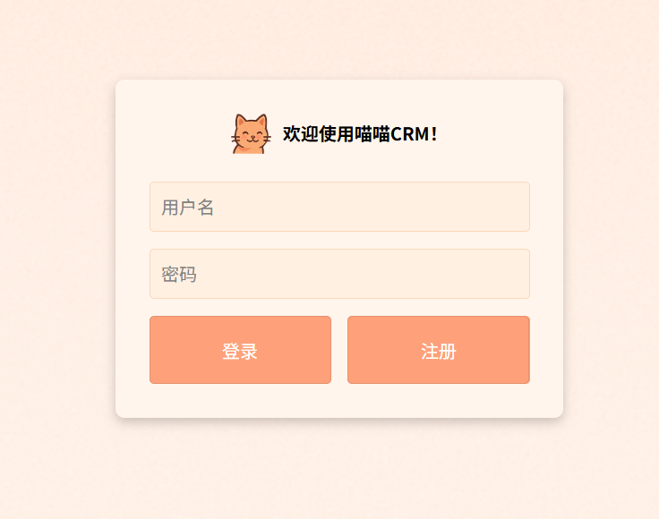
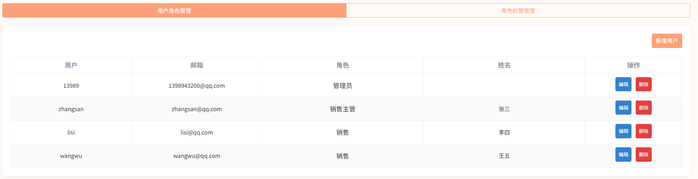
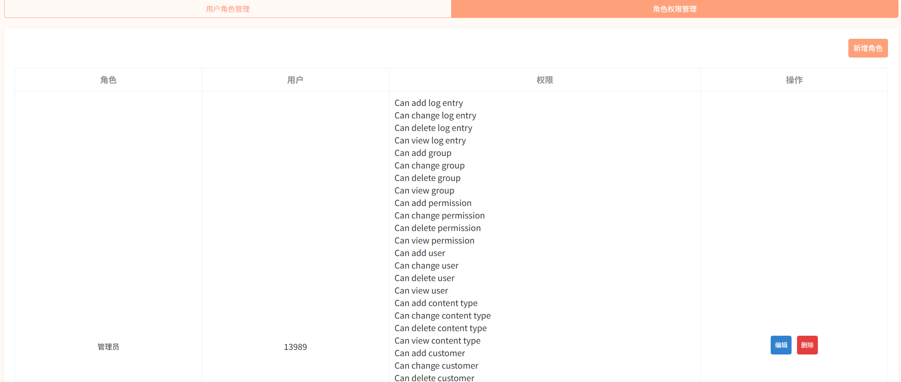
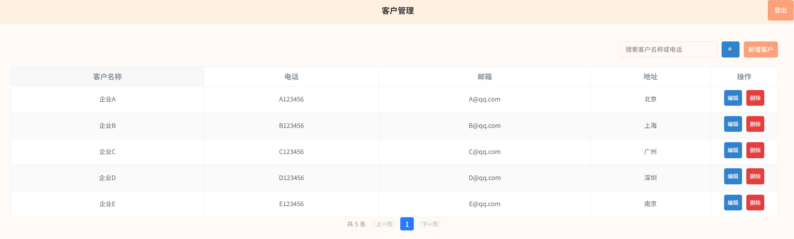
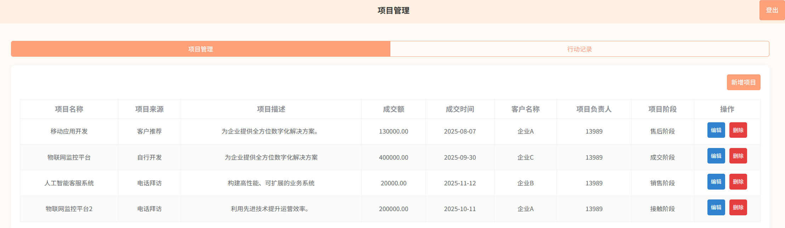
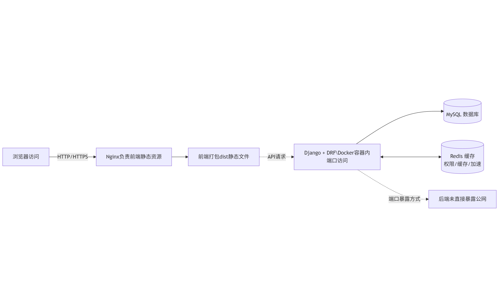

**其他语言版本: [English](README_EN.md), [中文](README.md).**
# 喵喵CRM - 企业客户与项目管理系统
一个基于Django+DRF+MySQL+Redis的轻量CRM系统，支持客户管理、项目管理、RBAC权限控制、缓存加速、Docker快速部署。
为中小团队构建简单高效的客户/项目跟踪后台。

## 技术栈
| 领域   |                 技术                  |
|:------:|:-----------------------------------:|
| 后端框架 |    Django/Django REST Framework     |
| 数据库  |                MySQL                |
| 缓存   |                Redis                |
| 授权认证 |                 JWT                 |
| 架构亮点 | RBAC权限模型/Redis缓存加速/Docker部署/接口分层设计  |
| 部署方式 |    Docker Compose+Nginx+Gunicorn    |

## 主要功能
用户：注册、登录、JWT认证



RBAC：角色-权限系统，接口级权限控制





客户管理：增删改查、搜索、分页



项目管理：归属客户、项目增晒改查、行动记录



数据缓存：客户列表缓存，减少DB压力


## 项目结构
```bash
miaomiaocrm/
├── docker-compose.yml
├── backend/
│   ├── mycrm/
│   │   ├── settings/
│   │   ├── urls.py
│   │   └── permissions.py
│   ├── user/
│   ├── permission/
│   ├── customer/
│   └── project/
└── frontend/
    ├── pages/
    ├── common/
    └── static/
```

## 系统架构图



## 接口说明
